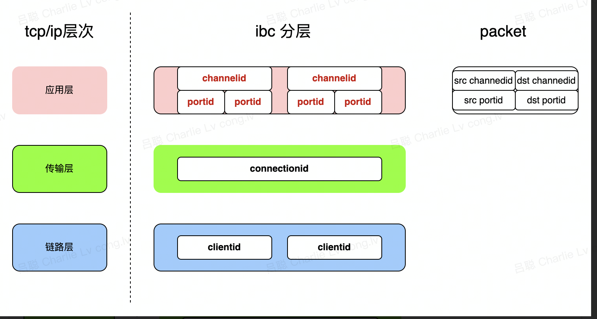
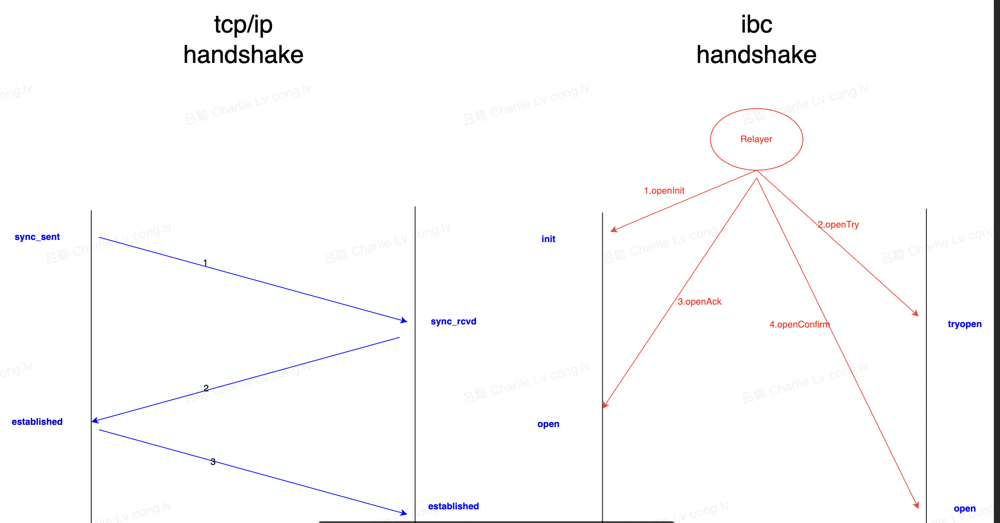
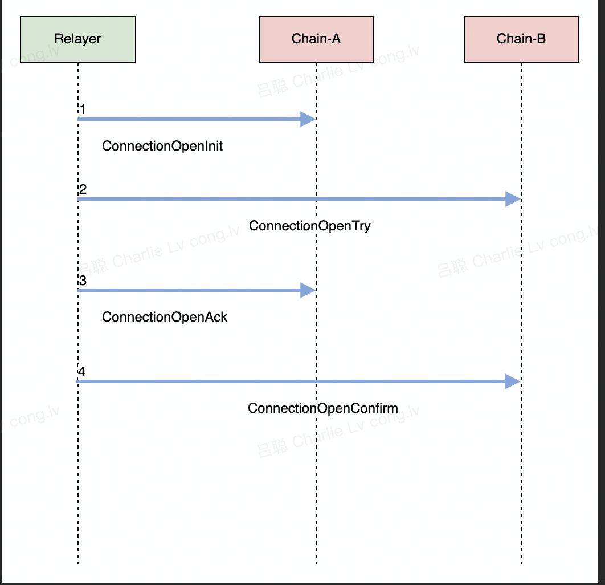
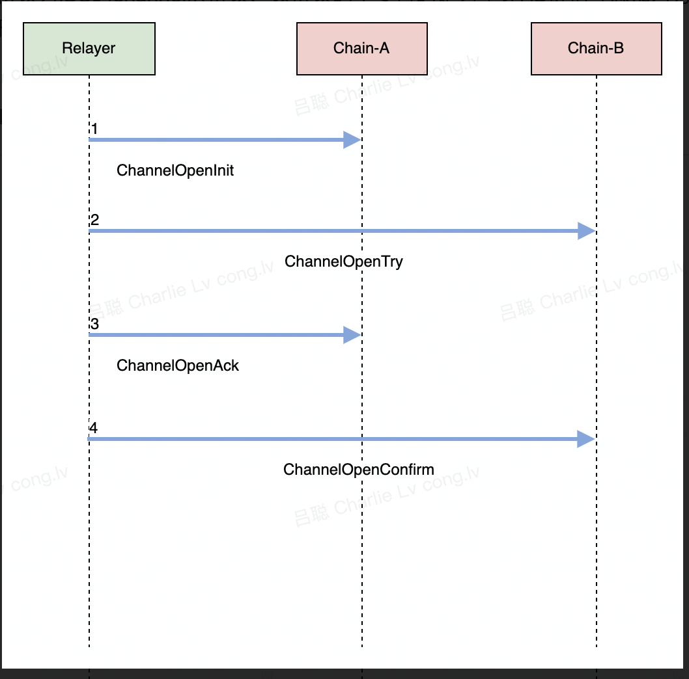
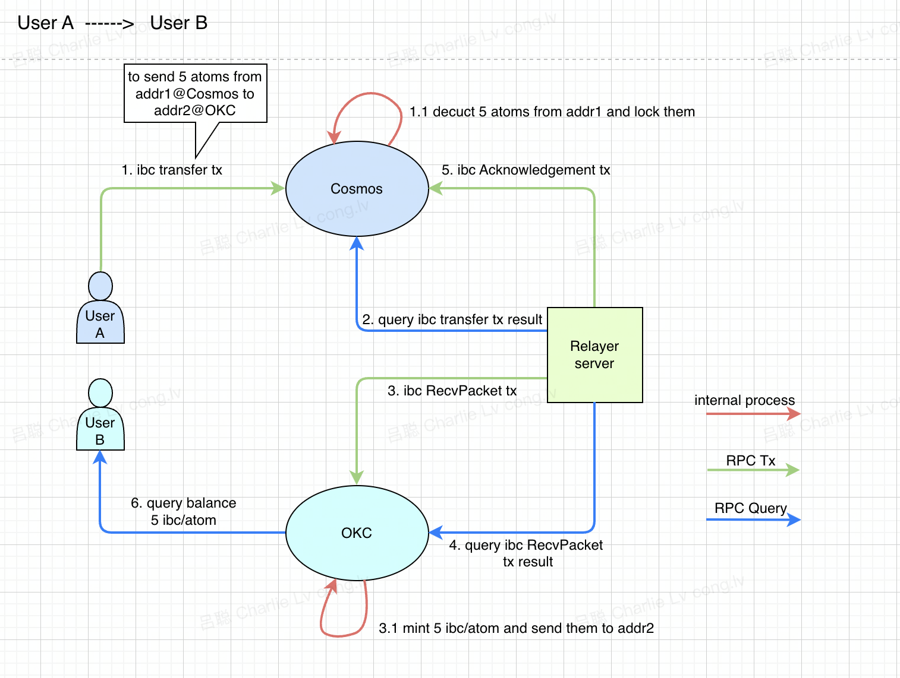

# IBC 详解

## 什么是IBC
- IBC 是 Inter-Blockchain Communication（跨链通信）的缩写。它是由 Tendermint、Interchain Foundation 和 Agoric Systems 等 IBC 贡献者开发的，作为更大的 Cosmos 网络生态系统的一部分。IBC 以最简单的形式，将不同的区块链连接在一起。到目前为止，像比特币、以太坊和其他许多区块链都是在自己的孤岛上运行，或者说每个区块链都是自己的荒岛，与世界其他地方或其他区块链断开连接，无法通信。它变得相当孤独。
- IBC 协议是区块链社交网络（沟通、交换 Token 和信息）的载体。IBC 有点像 TCP 协议对互联网的作用。在 TCP 之前，互联网是一个独立的计算机网络的集合，彼此之间无法良好的沟通。与 IP 一起，TCP/IP 规范了数据如何在计算机网络上发送和路由。今天，TCP/IP 无缝地支撑着我们每天消费和享受互联网的方式。同样地，IBC 规范了区块链的通信方式。因此，Cosmos 通常被称为「区块链互联网」。
  IBC原理
- 跨链的常见解决方案有如下几种
    - 公证人机制
    - 哈希锁定
    - 分布式私钥控制
    - 侧链/中继链

IBC算是公证人机制和侧链机制的融合和扩展,架构上采用的是基于中继链的多链多层拓展, IBC本身协议上与TCP类似,采取的是分层设计


## IBC基础概念
- 外部概念
    - Client：每个链都会有其对应的client(既clientId),负责记录对方链的信息
    - Connection:  两个clientEnd可以建立一个连接
    - port：  简单来说就是一个具体的应用程序,如代币转账,NFT转移
    - channel：     port到port代表一个channel，一个连接可以包含多个channel
- 内部概念
    - ClientState: 存储一些对方链的一些元数据信息
    - ConsensusState:存储对方链的共识信息,是IBC安全性的一个重要因素
## IBC核心原理

### handshake
- IBC连接的建立,类似于TCP三次握手


#### client层协议
- what:

    - client层是IBC协议的最底层,存储对等链的一些元数据信息

- how:

    - 在client层面,IBC存在4个消息类型

    - |      | message            | what                                              | when                             |      |
              | ---- | ------------------ | ------------------------------------------------- | -------------------------------- | ---- |
      | 1    | CreateClient       | 创建客户端，并生成ClientID,存储对等链的元数据信息 | 创建client时                     |      |
      | 2    | UpdateClient       | 更新client,保持链接的活性                         | 创建client之后的任意时刻都可以   |      |
      | 3    | UpgradeClient      | 得到通知对等链进行了一次元数据的更新升级          | 元数据需要进行更新时             |      |
      |      | SubmitMisbehaviour | 得到通知对等链存在可疑行为,对其进行冻结           | 监控程序发现client存在异常行为时 |      |

      client记录的元数据包含如下信息

      |      | 元数据信息         | what                                                         |
              | ---- | ------------------ | ------------------------------------------------------------ |
      | 1    | ChainId            | 对等链的链ID,比如说exchain-65                                |
      | 2    | TrustLevel         | 当更新client时,硬性要求被更新的数据的节点签名数占比(默认为1/3) |
      | 3    | TrustingPeriod     | client的有效时间,对等链在己方链活跃性的判断即是通过该元数据信息 |
      | 4    | FrozenHeight       | client存在作恶的可能性,该元数据表明该client是否有效          |
      | 5    | LatestHeight       | 对等链在己方链存储的最新高度信息                             |
      | 6    | ProofSpecs         | proof验证时候的一些元数据信息,如sha256/sha512等              |
      | 7    | Timestamp          | 对等链的block时间戳                                          |
      | 8    | Root               | 默克尔树的根hash                                             |
      | 9    | NextValidatorsHash | 下一次更新时期望的validator的hash                            |


#### connection层协议

- what:

    - connection是client的下一层协议,是IBC协议的过渡状态

- how

  

    - 在connection层面,也存在4个消息的处理

  |      | message               | what                                                         | where  |
      | ---- | --------------------- | ------------------------------------------------------------ | ------ |
  | 1    | ConnectionOpenInit    | 初始化连接                                                   | 己方链 |
  | 2.   | ConnectionOpenTry     | 建立连接,并验证请求建立连接的链中存储的己方链的ClientState/ConsensusState | 对等链 |
  | 3    | ConnectionOpenAck     | 己方链确认建立连接,并验证对等链中是否存储己方链的ClientState/ConsensusState | 己方链 |
  | 4    | ConnectionOpenConfirm | 对等链确认该链接的建立                                       | 对等链 |

#### channel层协议

- what
    - channel层是应用层协议,业务上的拓展都处于该维度
    - 所有应用层拓展都需是通过channel进行横向拓展

- how

  

    - 在channel层面,也存在4个消息的处理

  |      | message            | what                     | where  |
      | ---- | ------------------ | ------------------------ | ------ |
  | 1.   | ChannelOpenInit    | 己方链初始化数据通道     | 己方链 |
  | 2.   | ChannelOpenTry     | 对等链尝试初始化数据通道 | 对等链 |
  | 3.   | ChannelOpenAck     | 己方链确认建立通道       | 己方链 |
  | 4.   | ChannelOpenConfirm | 对等链也成功建立通道     | 对等链 |


### 中继转发
- IBC协议的一个核心组件是relayer中继器,中继器在IBC协议中起的作用是类似于一个搬运工,IBC所有的消息传输都是通过relayer中继器转发,既在IBC协议中,链从来不会主动的与对方链进行交互,一直是被动的接收
- cosmos官方现已实现三门语言的中继器
    - [go版本](https://github.com/cosmos/relayer)
    - [rust版本](https://github.com/informalsystems/hermes)
    - [ts版本](https://github.com/confio/ts-relayer)

### 安全性校验

- 活性维持与校验

    - what

        - client的元数据中存在有效期字段,该字段确保双方client此时都是活跃有效的

    - how

      

        - 当交易不活跃的时候,为了确保客户端不会过期,通常都会有后台定时程序定时的更新client

- proof的hash证明

    - what
        - 当relayer中继完数据包之后,对等链需要校验这个数据包的正确性,而正确性的校验是通过proof来进行证明实现
    - how
        - IBC的proof采用的是ICS23库,同样也是采用默克尔树实现的hash证明,局部叶子节点的变更会影响整体数据的hash计算

- 轻节点的安全性证明

    - what

        - 通过IBC协议连接的两条链,都会在各自链上维护对等链的轻节点信息,轻节点的安全等价于IBC协议的安全性

    - how

        - relayer中继数据包的时候,同时会携带一个UpdateClient message,该message 用于更新轻节点数据信息

        - 2/3共识

            - IBC现在主要还是依托于tendermint共识,因此其中一个核心条件即是轻节点中的header信息的投票信息要包含2/3的签名信息

        - 信任节点>= 1/3

            - 在IBC中,还存在一个核心的内部概念,TrustValidators,既受信任的节点,在2/3共识的基础下,必须还得有1/3的节点是在TrustValidators中,方可更新轻节点数据

          > 注意: 1/3 理论上是不安全的,因为当原有的1/3节点下线之后,对等链并没有及时的更新己方链的header信息,导致若原有1/3节点重新发送header信息,此时对等链依旧是可以校验通过的


### 简单举例

- Cosmos链上用户转移资产到OKC上
  

1. 用户A向链Cosmos发起ibc transfer交易。Cosmos收到交易后，锁定A账户中相应余额,并且生成一份凭证,存储在本地。
2. relayer从链Cosmos轮询transfer交易执行结果，并组装成RecvPacket。
3. relayer将RecvPacket 交易发送给链OKC。链OKC收到后，mint对应数量的币给对应的OKC账户,并且本地存储一份ack凭证.
4. relayer从链OKC轮询RecvPacket交易执行结果，并组装成Acknowledgemnt。
5. relayer将Acknowledgemnt 交易发送给链Cosmos。链Cosmos收到后，确认链OKC执行正常，如果异常则执行refund。

- 总结来说，代币转移的整个过程可以按如下描述
    - 握手建立连接 (这一步会涉及到 client => connection => channel)
    - 转账代币（目前只支持代币转账，nft等会后续支持）
    - 等待中继器中继数据包
- 整个过程与用户强关联的只有第一步`发起转账`


## OKC与IBC

- OKC的底层是早期的cosmos-sdk(v0.39),而IBC涉及到v0.40+的代码,39到40有较大的编解码的变更. OKC现不仅仅支持EVM体系,同时也支持IBC


### OKC-ERC20

- what

    - 跨链转账的原生代币到OKC之后,会自动的通过erc20合约生成对应的映射代币

- why

    - 生态价值,跨链的原生代币在OKC上认为是无商业价值,因此会自动的通过EVM转为合约映射币

- how

    - 通过IBC 应用层的钩子函数,使得逻辑下沉到evm层面,整个业务处理都是在同一个事务

- note

    - 合约地址的查询可以通过访问接口的方式查询

  > curl https://exchainrpc.okex.org/okexchain/v1/erc20/token_mapping


### OKC操作IBC指南

- 这里建议使用relayer来替代执行IBC相关功能,以[Go版本的relayer举例](https://github.com/cosmos/relayer)

- 创建连接

```
 rly tx clients oec100_ibc0 -d 
```

- 查询已创建的client

```
 exchaincli query ibc client states 
```

- 创建connection

```
 rly tx connection oec100_ibc0 -d 
```

- 查询已创建的connection

```
exchaincli query ibc connection  connections
```

- 创建channel

```
 rly tx channel oec100_ibc0 -d   
```

- 查询已创建的channel

```
exchaincli query ibc channel channels 
```

- 跨链转账

```
exchaincli tx ibc-transfer transfer transfer channel-0 cosmos1447ykk6kgrx5tl3qqlt9m55eu869kvn7g02w3k 10000wei --fees 100000000000000wei -b block -y --node tcp://127.0.0.1:26657 --home ${PWD}/data/exchain-100  --chain-id exchain-100 
```

- 查询packet commits

```
exchaincli query ibc channel    packet-commitments transfer channel-0
```

- relayer中继

```
rly start oec100_ibc0 -d
```

- 查询余额

```
gaiad query bank balances cosmos1447ykk6kgrx5tl3qqlt9m55eu869kvn7g02w3k 
```


